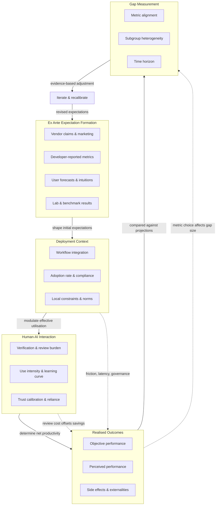

# Expectation--Realisation Gap: Socio-Technical Process Model

This file contains a candidate figure for the manuscript: a causal schematic of the expectation--realisation gap as a socio-technical feedback process.
It is not numbered and will not be included in the Manubot build.

## Mermaid Diagram

## Figure Legend

**Figure: The expectation--realisation gap as a socio-technical feedback process.**

This diagram models the lifecycle through which expectations about agentic AI systems form, encounter deployment reality, and are (or fail to be) recalibrated.
The process unfolds across five stages, each of which contributes to the observed discrepancy between what is promised and what is delivered.

### Ex Ante Expectation Formation

Expectations about an agentic AI system's value originate from four distinct sources, each with characteristic biases:

- **Vendor claims and marketing** frame benefits in terms designed to maximise perceived value---for example, "5 minutes saved per clinician per encounter" (Microsoft DAX Copilot).
  These claims typically reflect best-case or idealised usage scenarios and use metrics that may not correspond to what deployment evaluations actually measure.
- **Developer-reported performance metrics** derive from internal validation on curated datasets or controlled test environments.
  These metrics can substantially overestimate real-world performance due to evaluation choices (e.g., time-horizon AUCs that inflate discrimination, or inclusion of post-onset predictions in sepsis alerting models).
  The Epic Sepsis Model's internal AUC of 0.76--0.83 versus an externally validated AUC of 0.63 exemplifies this pattern.
- **User forecasts and intuitions** reflect what end-users expect to gain.
  These are shaped by marketing, peer reports, and general optimism about automation.
  In the METR RCT, experienced developers forecast a 24% speedup---an intuitive expectation that proved entirely wrong in direction.
- **Lab and benchmark results** provide controlled estimates of tool capability under low-context conditions.
  The GitHub Copilot lab trial (55.8% speedup on a self-contained task) demonstrates genuine tool capability, but this capability does not transfer to high-context, real-world settings where integration costs dominate.

The critical observation is that these four sources are rarely reconciled or critically compared before deployment decisions are made.
Each source has a structural tendency to overestimate benefits: vendors are incentivised to sell, developers validate under favourable conditions, users extrapolate from demos, and benchmarks strip away integration costs.

### Deployment Context

When an agentic system enters a real environment, three contextual factors modulate its effective utilisation:

- **Workflow integration** determines how seamlessly the system fits into existing practices.
  Clinical scribes must integrate with EHR systems, encounter scheduling, and documentation workflows; coding copilots must integrate with version control, code review, and testing pipelines.
  Friction at any point reduces effective usage.
- **Adoption rate and compliance** measure what fraction of potential users actually use the tool, and how consistently.
  The UCLA scribe RCT found tools were used in only 30--34% of visits, with 15% of assigned physicians never using their tool at all.
  Intention-to-treat benefits are mechanically attenuated by low compliance, regardless of per-use efficacy.
- **Local constraints and norms** include institutional policies, reimbursement structures, patient demographics, and professional norms that shape whether and how a tool is used.
  Watson for Oncology's concordance dropped dramatically in Korea relative to the Indian tumour board used for initial validation, driven by age-specific treatment norms and reimbursement differences.

### Human-AI Interaction

At the point of use, three interaction dynamics determine the net productivity impact:

- **Verification and review burden** is the time and cognitive effort required to check, edit, and validate AI-generated outputs.
  This is the single most under-accounted cost in pre-deployment projections.
  In the METR trial, review and debugging time exceeded generation time savings, producing a net slowdown.
  In clinical documentation, "occasional" clinically significant inaccuracies and neutral ratings on note quality indicate substantial editing work.
- **Use intensity and learning curve** capture how deeply users engage with the tool over time.
  Dose--response effects are documented (e.g., each 10 percentage-point increase in AI scribe usage yields ~30 seconds savings per scheduled hour), but the learning curve also implies that early adopters may not reach steady-state benefit for weeks or months.
- **Trust calibration and reliance patterns** describe whether users appropriately calibrate their trust.
  Over-trust leads to under-verification (accepting erroneous outputs); under-trust leads to redundant checking.
  The perception--reality mismatch in AI scribes (86.5% perceived time savings with no objective association) suggests that many users over-trust the tool's contribution, which may reduce vigilance against errors without producing commensurate time savings.

### Realised Outcomes

The actual impact of the system manifests across three dimensions, not all of which are typically measured:

- **Objective performance** is what controlled evaluations measure: time-in-note, task completion time, AUC, concordance, issues resolved per hour.
  These are the hard numbers that reveal the gap.
- **Perceived performance** is what users report experiencing.
  The systematic divergence between perceived and objective performance (documented in AI scribes and software copilot self-assessments) means that satisfaction surveys and user testimonials are unreliable indicators of actual impact.
- **Side effects and externalities** include downstream consequences not captured by primary productivity metrics: security vulnerabilities in AI-generated code (32.8% of Python snippets flagged), after-hours EHR time increases despite in-session documentation savings, and potential long-term skill degradation from cognitive offloading (students scored 11 percentage points lower on retention after ChatGPT use).

### Gap Measurement

The measured size and direction of the expectation--realisation gap depend on methodological choices:

- **Metric alignment** asks whether the metric used to set expectations is the same metric used to evaluate outcomes.
  "Minutes saved per encounter" (vendor claim) versus "time-in-note" (trial measure) is a construct mismatch that can make the gap appear larger or smaller depending on perspective.
  Developer-reported AUCs computed over different time horizons or denominators than external validations produce non-comparable numbers.
- **Subgroup heterogeneity** means that the gap is not a single number.
  High-friction users may benefit; low-friction users may be harmed.
  Reporting only average effects conceals this, making the "gap" appear moderate when it is actually large and negative for some subgroups and positive for others.
- **Time horizon** determines whether short-term task completion gains are offset by long-run costs.
  Retention and skill formation effects (documented over 45-day horizons in educational settings) are invisible in evaluations that measure only immediate throughput.

### Feedback and Iteration

The final arrow---from gap measurement back to expectation formation---represents the recalibration loop.
In a well-functioning system, measured gaps would feed back to revise expectations: procurement teams would demand evidence-based projections, developers would report externally validated metrics, and users would adjust forecasts based on observed performance.

In practice, this loop is weak or absent.
Vendor claims are rarely updated based on independent evaluations.
Developer metrics are not routinely reconciled with external validation.
User perceptions remain disconnected from objective measurement.
The expectation--realisation gap persists because the feedback loop is broken.

The Agentic Automation Canvas addresses this by structuring the loop explicitly: requiring quantified expectations at the outset, dual-perspective confidence assessments, human oversight cost deductions, and outcome metrics linked back to initial projections---creating the institutional mechanism for the recalibration that the current ecosystem lacks.
